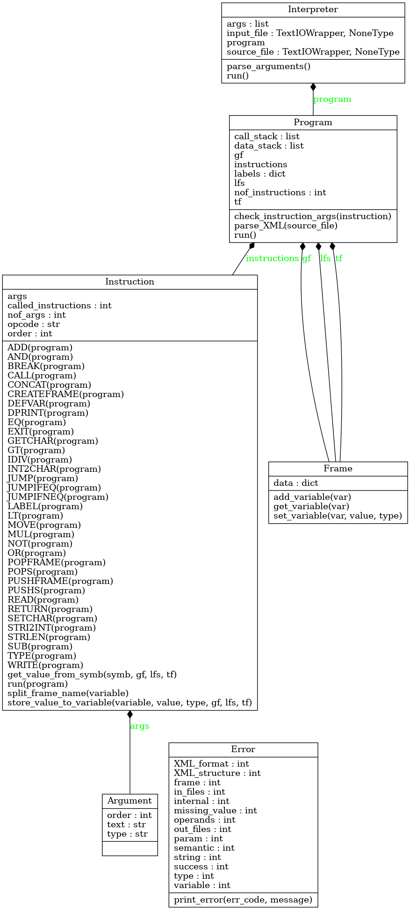

# IPP 2: Interpret of IPPcode23
Documentation of project 2 for IPP 2022/2023

Name and surname: Timotej Bucka

Login: xbucka00

## Naviagation
1. [Introduction](#introduction)
2. [Program structure](#program-structure)
3. [Implementation](#implementation)
4. [UML diagram](#uml-diagram)

## Introduction
The program is an interpreter of the IPPcode23 language, which was parsed to XML format. The program parses the XML code and executes it according to the IPPcode23 language specification. The program is written in Python 3.10 .

## Program structure
Program consists of these files:
- `interpret.py` - contains the main function of the program
- `Interpreter.py` - contains the class `Interpreter`
- `Program.py` - contains the class `Program`
- `Frame.py` - contains the class `Frame`
- `Instruction.py` - contains the class `Instruction`
- `Argument.py` - contains the class `Argument`
- `Error.py` - contains the class `Error`

Used modules:
- `argparse` - parsing command line arguments
- `os` - checking if the file exists
- `sys` - calling `sys.exit()` and accessing system variables
- `xml.etree.ElementTree` - parsing XML file

## Implementation
The program is started in `interpret.py`, where the function `main()` is called. In this function a new instance of class `Interpreter` is created.

### Class `Interpreter`
Instance variables:
- `self.args` - parsed command line arguments
- `self.source_file` - file with XML code
- `self.input_file` - file with input for the interpreted program
- `self.program` - instance of class `Program`

The `Interpreter` class is a singleton, so the instance is created only once:
```py
class Interpreter:

    def __new__(cls):
        if not hasattr(cls, 'instance'):
            cls.instance = super(Interpreter, cls).__new__(cls)
        return cls.instance 

    ...
```
In the class' `__init__()` method, the command line arguments are parsed and the proper file is set for reading the XML code (`source_file`) and input (of the interpreted program) (`input_file`). If one of these arguments is missing the `sys.stdin` is assigned as the source of content. The `run()` method creates an instance of class `Program` and calls its `parse()` and `run()` methods.

### Class `Program`
Instance variables:
- `self.instructions` - list containing instances of class `Instruction`
- `self.nof_instructions` - number of instructions
- `self.labels` - dictionary of labels in format: `{label_name: position}`
- `self.call_stack` - stack of position indexes of the instruction `CALL`
- `data_stack` - stack of data pushed by instruction `PUSHS` in format: `[(type, value), ...]`
- `self.gf` - instance of class `Frame` representing global frame
- `self.lfs` - stack of instances of class `Frame` representing local frames
- `self.tfs` - instance of class `Frame` representing temporary frame

Method `parse_XML(source_file)` parses the XML from the source_file (file or `sys.stdin`). While parsing, the program performs syntax check of the XML code. The `instructions` list is filled with instances of class `Instruction` and the `labels` dictionary is filled with labels. `check_instruction_args(instruction)` checks wether the arguments of `instruction` are correct. The `run()` method goes through the `instructions` list and executes each instruction. These instructions may not be run in order in case of a jump:
```py
instr_num = 0
while instr_num < self.nof_instructions:
    next_num = self.instructions[instr_num].run(self)
    if next_num != None:
        instr_num = next_num
    instr_num += 1
```

### Class `Instruction`
Class variables:
- `called_instructions` - number of called instructions. 
Instance variables:
- `self.order` - order of the instruction in the XML code (0 - number of instructions)
- `self.opcode` - opcode of the instruction
- `self.args` - list of instances of class `Argument` representing arguments of the instruction
- `self.nof_args` - number of arguments

The `run(program)` method has a parameter that is an instance of `Program` class. This is because `Program` class contains necessary variables that describe the context in which the program is in at a particular time (frames, labels, ...). Method `run()` calls the class method that has the same name as the `opcode`. Eg. `opcode` = `MOVE`, method `MOVE(program)` is called.
```py
try:
    func = getattr(self, self.opcode)   # get function by opcode string (MUL -> self.MUL)
except AttributeError:
    Error.print_error(Error.semantic, "line " + str(self.order) + ": Unknown opcode")
next_step = func(program)   # calls proper function
```
The `next_step` variable determines what instruction is to be executed next. If `next_step` is `None`, the following instruction is executed. If `next_step` is an integer, the instruction with index `next_step` + 1 is executed. This is achieved thanks to the `run()` method of class `Program`.

### Class `Frame`
Instance variables:
- `self.data` - dictionary of variables in format: `{var_name: [type, value]}`

The class contains methods `add_variable()`, `get_variable()` and `set_variable()` that manage the variables in the frame.

### Class `Argument`
Instance variables:
- `self.order` - order of the argument in instruction
- `self.type` - type of the argument
- `self.text` - text inside the `<arg{order}>` XML tag

### Class `Error`
Contains error codes. The `print_error()` method prints the error message to `sys.stderr` and calls `sys.exit()` with the proper error code.

## UML diagram
